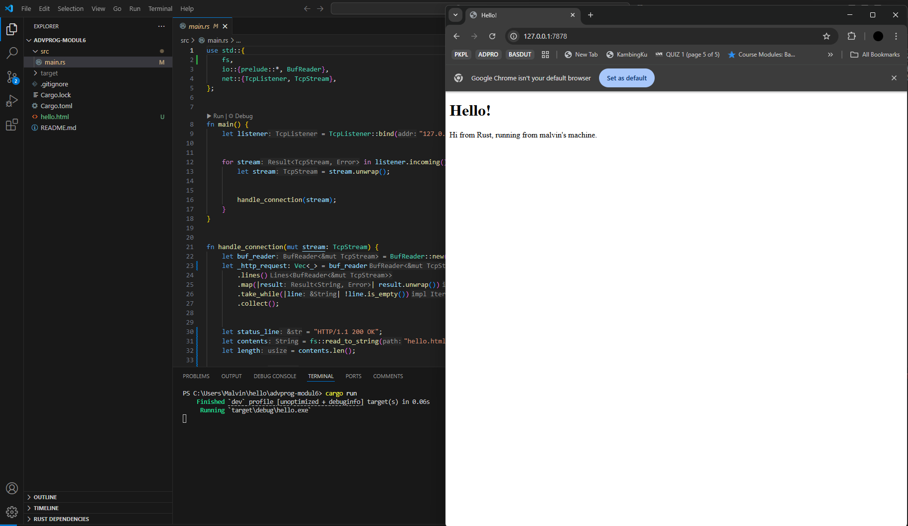
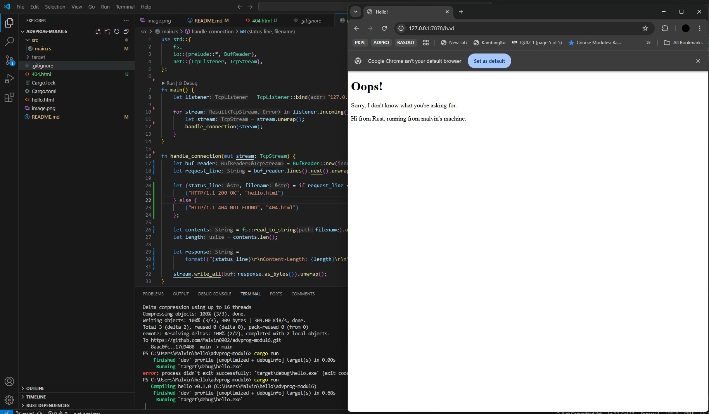

# Commit 1 Reflection notes

## Inside the `handle_connection` Method  

### 1. Receiving `TcpStream` as a Parameter  
The `handle_connection` method receives a `stream`, which is of type `TcpStream`. This type is used for reading and writing data over a TCP connection.  

### 2. Creating a `BufReader`  
Next, the `handle_connection` method creates a `BufReader` that wraps the `stream` to process data line by line.  

### 3. Reading the HTTP Request Line by Line  
- The `lines()` method is used to read the data stream one line at a time.  
- The `map()` function converts each line into a `String`.  
- This process continues until an empty line is found using `take_while()`.  
- Finally, `collect()` gathers the lines into a `Vec<String>` containing the HTTP request lines.  
- This data is stored in the `http_request` variable.  

### 4. Printing the HTTP Request  
Finally, the `handle_connection` method prints the contents of `http_request`.  

# Commit 2 Reflection notes

##  New handle_connection

1. **Define the Response Status**  
   Set the response status to `"HTTP/1.1 200 OK"` to indicate that the request was successfully processed.

    ```rust
    let status_line = "HTTP/1.1 200 OK";
    ``` 

2. **Read the HTML File into a String**  
   Read the contents of `hello.html` into a string.
 
    ```rust
    let contents = fs::read_to_string("hello.html").unwrap();
    ``` 

3. **Calculate the Content Length**  
   Determine the length of the HTML content.

    ```rust
    let length = contents.len();
    ``` 

4. **Construct the Full HTTP Response**  
   Format the response with the status line, content length, and body.

    ```rust
    let response =
        format!("{status_line}\r\nContent-Length:{length}\r\n\r\n{contents}");
    ``` 

5. **Send the Response to the Client**  
   Convert the response into bytes and send it through the stream.

    ```rust
    stream.write_all(response.as_bytes()).unwrap();
    ``` 

## Web Browser Output
When accessed via a web browser, this response will display the contents of `hello.html`.



# Commit 3 Reflection notes

## how to split between response and why the refactoring is needed

To separate one response from another, we can analyze the request method, path, and HTTP version in the HTTP headers.

When the request method is GET, the path is /, and the HTTP version is 1.1, we return the response with hello.html. For other paths and methods, we send a "Not Found" response or 404.html.

## Importance of Refactoring

Refactoring is essential because it helps keep the code clean, well-structured, and easier to maintain and update. It reduces code duplication, improves test quality, and makes development more efficient in the long run. By refactoring, we ensure that the application can grow and evolve without becoming overly complex and difficult to maintain.

